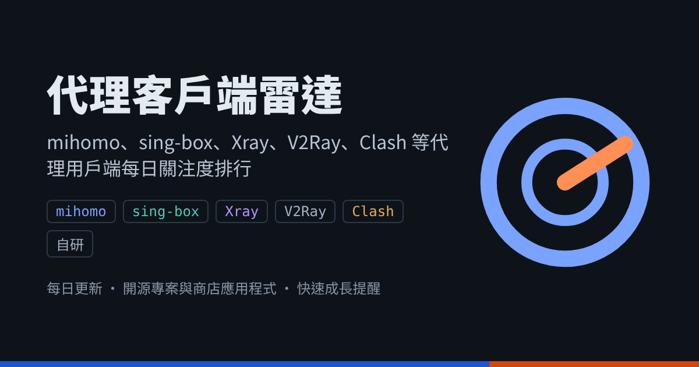

# 代理客戶端雷達

[简体中文](README.md) · **繁體中文**

每日追蹤 mihomo、sing-box、Xray、V2Ray、Clash 及自研核心的代理用戶端：開源專案看 GitHub Star，商店應用程式看美區 App Store / Google Play 評分數。

**資料日期：2026-10-10** · [網頁版（可篩選、排序）](https://dailileida.com/zh-tw/)

## 關注度快速成長

- **[Bettbox](https://github.com/appshubcc/Bettbox)** · 高增速、新秀 — 30 天 +611（+15.3%），7 天 +97；建立未滿一年，涵蓋鴻蒙與 Android TV。
- **[ClashBar](https://github.com/Sitoi/ClashBar)** · 高增速、新秀 — 30 天 +171（+11.4%），總 Star 約 1.5k；2026 年 2 月建立的原生 macOS 選單列 mihomo 用戶端，本週成長放緩。
- **[Satelite Proxy](https://github.com/zn0wii/satelite-proxy)** · 高增速、新秀 — 2026 年 8 月建立，30 天 +429（+48.6%），總 Star 882；sing-box / Xray / mihomo 三核心桌面用戶端。
- **[Happ](https://apps.apple.com/us/app/id6504287215)** (App Store) · 快速成長 — 美區評分數 16,545，較首次記錄（3 天）+1,369（+8.3%）；6.0.0 於 10 月 5 日發布。
- **[incy](https://apps.apple.com/us/app/id6756943388)** (App Store) · 快速成長 — 美區評分數 323，較首次記錄（3 天）+47（+14.6%），平均分升至 3.86。
- **[sing-box MT](https://apps.apple.com/us/app/id6785326793)** (App Store) · 新上架 — 2026 年 8 月 31 日上架，已有 119 則評分、平均 4.66；最新 1.14.6。

GitHub 近 7 天新增 Star 最多：**Clash Verge Rev** +1,000 · **FlClash** +618 · **Clash Meta for Android** +350

## 開源用戶端

依 30 日成長率排序

| # | 用戶端 | 核心 | 平台 | Star | 7 日 | 30 日 | 30 日成長率 | 最近更新 |
|---:|---|---|---|---:|---:|---:|---:|---|
| 1 | [Satelite Proxy](https://github.com/zn0wii/satelite-proxy) | sing-box / Xray / mihomo | Windows · macOS | 882 | +0 | +429 | 48.6% | — |
| 2 | [OneXray](https://github.com/YuanDevTeam/OneXray) | Xray | iOS · macOS · Android · Windows · Linux | 646 | +31 | +115 | 17.8% | 2026-10-09 |
| 3 | [Bettbox](https://github.com/appshubcc/Bettbox) | mihomo | Windows · macOS · Linux · Android · Android TV · HarmonyOS | 3,982 | +97 | +611 | 15.3% | 2026-10-07 |
| 4 | [ClashBar](https://github.com/Sitoi/ClashBar) | mihomo | macOS | 1,500 | +0 | +171 | 11.4% | 2026-10-01 |
| 5 | [FlClash](https://github.com/chen08209/FlClash) 推薦 | mihomo | Android · Windows · macOS · Linux | 54.6k | +618 | +3,300 | 6.0% | 2026-10-07 |
| 6 | [Throne](https://github.com/throneproj/Throne) | sing-box | Windows · Linux | 7,377 | +66 | +374 | 5.1% | 2026-10-08 |
| 7 | [Clash Mi](https://github.com/KaringX/clashmi) | mihomo | iOS · Android · macOS · Windows · Linux | 9,672 | +65 | +488 | 5.0% | 2026-10-08 |
| 8 | [FlClashX](https://github.com/pluralplay/FlClashX) | mihomo | Android · Windows · macOS · Linux | 1,451 | +17 | +72 | 5.0% | 2026-09-02 |
| 9 | [Karing](https://github.com/KaringX/karing) 推薦 | sing-box | iOS · Android · macOS · Windows · Linux · tvOS | 15.4k | +186 | +728 | 4.7% | 2026-10-02 |
| 10 | [Clash Verge Rev](https://github.com/clash-verge-rev/clash-verge-rev) 推薦 | mihomo | Windows · macOS · Linux | 149.8k | +1,000 | +6,600 | 4.4% | 2026-10-09 |
| 11 | [husi](https://github.com/xchacha20-poly1305/husi) | sing-box | Android | 1,822 | +11 | +74 | 4.1% | 2026-09-21 |
| 12 | [Xray (SaeedDev94)](https://github.com/SaeedDev94/Xray) | Xray | Android | 509 | +0 | +20 | 3.9% | 2026-08-23 |
| 13 | [mihoro](https://github.com/spencerwooo/mihoro) | mihomo | Linux 命令列 | 312 | +0 | +12 | 3.8% | 2026-04-25 |
| 14 | [Clash Meta for Android](https://github.com/MetaCubeX/ClashMetaForAndroid) | mihomo | Android | 47.2k | +350 | +1,700 | 3.6% | 2026-10-06 |
| 15 | [YumeBox](https://github.com/YumeLira/YumeBox) | mihomo | Android | 1,002 | +6 | +36 | 3.6% | 2026-10-06 |
| 16 | [Invisible Man XRay](https://github.com/InvisibleManVPN/InvisibleMan-XRayClient) | Xray | Windows · Linux | 852 | +0 | +30 | 3.5% | 2026-09-18 |
| 17 | [Koala Clash](https://github.com/coolcoala/koala-clash) | mihomo | Windows · macOS · Linux | 691 | +4 | +22 | 3.2% | 2026-10-07 |
| 18 | [OneBox](https://github.com/OneOhCloud/OneBox) | sing-box | macOS · Windows · Linux | 688 | +3 | +21 | 3.1% | 2026-10-07 |
| 19 | [Amnezia VPN](https://github.com/amnezia-vpn/amnezia-client) 推薦 | 自研 / Xray | Windows · macOS · Linux · Android · iOS | 15.4k | +69 | +417 | 2.7% | 2026-10-07 |
| 20 | [Surfing](https://github.com/GitMetaio/Surfing) | mihomo | Android Root | 2,438 | +8 | +65 | 2.7% | 2026-10-07 |
| 21 | [Zephyr](https://github.com/Juwan-Hwang/Zephyr) | mihomo | Windows · macOS · Linux | 711 | +3 | +18 | 2.5% | 2026-09-11 |
| 22 | [v2rayNG](https://github.com/2dust/v2rayNG) 推薦 | Xray / V2Ray | Android | 63.6k | +276 | +1,500 | 2.4% | 2026-10-07 |
| 23 | [Exclave](https://github.com/dyhkwong/Exclave) | V2Ray | Android | 2,822 | +9 | +65 | 2.3% | 2026-10-07 |
| 24 | [ShellCrash](https://github.com/juewuy/ShellCrash) | mihomo / sing-box | 路由器 · Linux 命令列 | 13.6k | +22 | +310 | 2.3% | 2026-10-09 |
| 25 | [Nikki](https://github.com/nikkinikki-org/OpenWrt-nikki) | mihomo | OpenWrt | 5,330 | +17 | +117 | 2.2% | 2026-10-07 |
| 26 | [NekoBox for Android](https://github.com/MatsuriDayo/NekoBoxForAndroid) | sing-box | Android | 23k | +108 | +474 | 2.1% | 2026-02-09 |
| 27 | [clash-for-linux (wnlen)](https://github.com/wnlen/clash-for-linux) | mihomo | Linux | 6,101 | +10 | +119 | 2.0% | — |
| 28 | [HomeProxy](https://github.com/immortalwrt/homeproxy) | sing-box | ImmortalWrt | 1,087 | +3 | +21 | 1.9% | 2026-10-07 |
| 29 | [Hiddify](https://github.com/hiddify/hiddify-app) 推薦 | sing-box | Android · iOS · Windows · macOS · Linux | 33.1k | +141 | +626 | 1.9% | 2026-10-07 |
| 30 | [clash-for-linux-install](https://github.com/nelvko/clash-for-linux-install) | mihomo | Linux 命令列 | 14.9k | +24 | +279 | 1.9% | 2026-10-07 |
| 31 | [Clash Party](https://github.com/mihomo-party-org/clash-party) | mihomo | Windows · macOS · Linux | 26.7k | +75 | +493 | 1.8% | 2026-10-09 |
| 32 | [v2rayN](https://github.com/2dust/v2rayN) 推薦 | Xray / sing-box | Windows · macOS · Linux | 117.7k | +349 | +2,100 | 1.8% | 2026-10-06 |
| 33 | [Sparkle](https://github.com/xishang0128/sparkle) | mihomo | Windows · macOS · Linux | 7,907 | +25 | +126 | 1.6% | 2026-10-08 |
| 34 | [ClashMac](https://github.com/666OS/ClashMac) | mihomo | macOS | 6,310 | +8 | +92 | 1.5% | 2026-10-07 |
| 35 | [GUI.for.Clash](https://github.com/GUI-for-Cores/GUI.for.Clash) | mihomo | Windows · macOS · Linux | 2,828 | +0 | +41 | 1.4% | 2026-09-08 |
| 36 | [OpenClash](https://github.com/vernesong/OpenClash) 推薦 | mihomo | OpenWrt | 27.7k | +57 | +349 | 1.3% | 2026-10-07 |
| 37 | [GUI.for.SingBox](https://github.com/GUI-for-Cores/GUI.for.SingBox) | sing-box | Windows · macOS · Linux | 8,193 | +15 | +95 | 1.2% | 2026-10-07 |
| 38 | [v2rayA](https://github.com/v2rayA/v2rayA) | Xray / V2Ray | Linux · Windows · macOS | 15.7k | +28 | +172 | 1.1% | 2026-10-08 |
| 39 | [Prizrak-Box](https://github.com/legiz-ru/Prizrak-Box) | mihomo | Windows · macOS · Linux | 367 | +0 | +4 | 1.1% | 2026-09-12 |
| 40 | [ClashX Meta](https://github.com/MetaCubeX/ClashX.Meta) | mihomo | macOS | 6,278 | +12 | +61 | 1.0% | 2026-10-07 |
| 41 | [PassWall](https://github.com/Openwrt-Passwall/openwrt-passwall) | Xray / sing-box | OpenWrt | 9,947 | +9 | +68 | 0.7% | 2026-10-07 |
| 42 | [Clash for Windows 改进版](https://github.com/Z-Siqi/Clash-for-Windows_Chinese) | mihomo | Windows | 28.6k | +19 | +152 | 0.5% | 2026-10-05 |
| 43 | [Clash Nyanpasu](https://github.com/libnyanpasu/clash-nyanpasu) | mihomo | Windows · macOS · Linux | 13.2k | +13 | +69 | 0.5% | 2026-10-07 |
| 44 | [Outline](https://github.com/Jigsaw-Code/outline-apps) | 自研 | Windows · macOS · Linux · Android · iOS · ChromeOS | 9,267 | +9 | +32 | 0.3% | 2026-10-09 |
| 45 | [SimpleXray](https://github.com/lhear/SimpleXray) | Xray | Android | 343 | +0 | +1 | 0.3% | 2026-04-13 |
| 46 | [fancyss](https://github.com/hq450/fancyss) | Xray / V2Ray / 自研 | 华硕路由器 (AsusWRT/Merlin) | 13.8k | +0 | +35 | 0.3% | 2026-06-01 |
| 47 | [V2RayXS](https://github.com/tzmax/V2RayXS) | Xray | macOS | 1,256 | +0 | +3 | 0.2% | 2026-08-07 |
| 48 | [Netch](https://github.com/netchx/netch) | 自研 | Windows | 17.7k | +6 | +38 | 0.2% | 2026-10-07 |
| 49 | [Shadowsocks for Android](https://github.com/shadowsocks/shadowsocks-android) | 自研 | Android | 36.8k | +13 | +71 | 0.2% | 2026-10-07 |
| 50 | [Brook](https://github.com/txthinking/brook) | 自研 | Windows · macOS · Linux · Android · iOS · OpenWrt | 15.2k | +4 | +27 | 0.2% | 2026-10-07 |
| 51 | [V2rayU](https://github.com/yanue/V2rayU) | Xray / V2Ray | macOS | 20.2k | +2 | +27 | 0.1% | 2026-08-02 |
| 52 | [Shadowsocks for Windows](https://github.com/shadowsocks/shadowsocks-windows) | 自研 | Windows | 59.5k | +17 | +64 | 0.1% | 2026-10-07 |
| 53 | [ShadowsocksX-NG](https://github.com/shadowsocks/ShadowsocksX-NG) | 自研 | macOS | 32.9k | +2 | +17 | 0.1% | 2026-10-07 |

## 商店應用程式

依 30 日成長率排序，資料不足時依評分數

| # | 應用程式 | 商店 | 核心 | 裝置 | 價格 | 評分 | 評分數 | 7 日 | 最近更新 |
|---:|---|---|---|---|---|---:|---:|---:|---|
| 1 | [incy](https://apps.apple.com/us/app/id6756943388) | App Store | Xray | iPhone · iPad | 免費 | 3.86 | 323 | +47 | 2026-09-21 |
| 2 | [Happ](https://apps.apple.com/us/app/id6504287215) 推薦 | App Store | Xray | iPhone · iPad · Mac | 免費 | 4.64 | 16.5k | +1,369 | 2026-10-05 |
| 3 | [Streisand](https://apps.apple.com/us/app/id6450534064) | App Store | Xray | iPhone · iPad | 免費 | 4.36 | 2,099 | +49 | 2026-09-10 |
| 4 | [Hiddify](https://apps.apple.com/us/app/id6596777532) | App Store | sing-box | iPhone · iPad | 免費 | 4.44 | 828 | +17 | 2026-02-19 |
| 5 | [Shadowrocket](https://apps.apple.com/us/app/id932747118) 推薦 | App Store | 自研 | iPhone · iPad · Mac | $2.99 | 4.49 | 12.1k | +11 | 2026-09-07 |
| 6 | [Stash](https://apps.apple.com/us/app/id1596063349) 推薦 | App Store | Clash 相容 | iPhone · iPad | $5.99 | 4.36 | 1,236 | +1 | 2026-07-16 |
| 7 | [V2Box](https://apps.apple.com/us/app/id6446814690) 推薦 | App Store | Xray | iPhone · iPad · Mac | 免費 | 4.72 | 98k | +0 | 2026-08-17 |
| 8 | [Quantumult X](https://apps.apple.com/us/app/id1443988620) | App Store | 自研 | iPhone · iPad · Mac | $9.99 | 3.80 | 1,649 | +0 | 2026-10-07 |
| 9 | [Surge 5](https://apps.apple.com/us/app/id1442620678) | App Store | 自研 | iPhone · iPad | 免費 | 4.09 | 993 | +0 | 2026-09-13 |
| 10 | [Karing](https://apps.apple.com/us/app/id6472431552) 推薦 | App Store | sing-box | iPhone · iPad · Mac | 免費 | 4.61 | 682 | +0 | 2026-09-11 |
| 11 | [Loon](https://apps.apple.com/us/app/id1373567447) | App Store | 自研 | iPhone · iPad | $7.99 | 3.94 | 500 | +0 | 2026-06-25 |
| 12 | [Clash Mi](https://apps.apple.com/us/app/id6744321968) 推薦 | App Store | mihomo | iPhone · iPad | 免費 | 4.65 | 423 | +0 | 2026-09-02 |
| 13 | [sing-box MT](https://apps.apple.com/us/app/id6785326793) 推薦 | App Store | sing-box | iPhone · iPad · Apple TV | 免費 | 4.66 | 119 | +0 | 2026-09-24 |
| 14 | [Egern](https://apps.apple.com/us/app/id1616105820) | App Store | 自研 | iPhone · iPad | 免費 | 4.20 | 85 | +0 | 2026-07-23 |
| 15 | [Anywhere Proxy](https://apps.apple.com/us/app/id6758235178) | App Store | 自研 | iPhone · iPad · Apple Watch · Apple TV | 免費 | 4.74 | 54 | +0 | 2026-09-29 |
| 16 | [FoXray](https://apps.apple.com/us/app/id6448898396) | App Store | Xray | iPhone · iPad · Mac | 免費 | 3.90 | 42 | — | — |
| 17 | [RabbitHole](https://apps.apple.com/us/app/id6683309629) | App Store | mihomo | iPhone · iPad · Mac | 免費 | 3.95 | 20 | +0 | 2026-07-28 |
| 18 | [Surfboard](https://play.google.com/store/apps/details?id=com.getsurfboard) | Google Play | 自研 | Android | 免費 | — | — | — | 2026-07-07 |

## 已停止維護

以下用戶端已停止維護（多數隨原版 Clash 核心在 2023 年 11 月停更），僅供參考： Clash for Android、Clash for Windows、[Clash Verge](https://github.com/zzzgydi/clash-verge)、[clashN](https://github.com/2dust/clashN)、ClashX Pro、ClashX、[Qv2ray](https://github.com/Qv2ray/Qv2ray)

---

標記規則：高增速 = 30 日新增 ≥150 且 ≥ 總 Star 的 8%；加速中 = 7 日新增 ≥100 且 7 日日均 ≥ 30 日日均的 1.25 倍；新秀 = 建立不滿一年且 30 日新增 ≥150；新上架 = 商店上架不滿 180 天。

資料來源：GitHub、gittrend.io、美區 App Store 與 Google Play。每天台北時間上午約 9 點自動更新。
